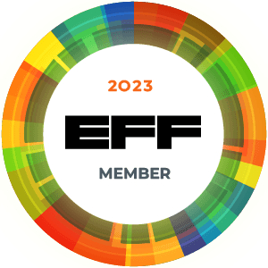
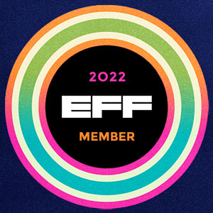

<!-- SVG Typing Animation  -->

---

<h3>

    `I'm Smart Enough to Know That I'm Dumb`
    
</h3>

<h2> 

    𝐇𝐞𝐥𝐥𝐨 𝐭𝐡𝐞𝐫𝐞 𝐟𝐞𝐥𝐥𝐨𝐰 <𝚌𝚘𝚍𝚎𝚛𝚜 />! & hackers 
    
</h2>

<h2>

  
---

    

</h2>

---

 

    
    
 

    
 

    

    

<!--
**D4nk0St0rM/D4nk0St0rM** is a ✨ _special_ ✨ repository because its `README.md` (this file) appears on your GitHub profile.

Here are some ideas to get you started:

- 🔭 I’m currently working on ...
- 🌱 I’m currently learning ...
- 👯 I’m looking to collaborate on ...
- 🤔 I’m looking for help with ...
- 💬 Ask me about ...
- 📫 How to reach me: ...
- 😄 Pronouns: ...
- ⚡ Fun fact: ...

-->

